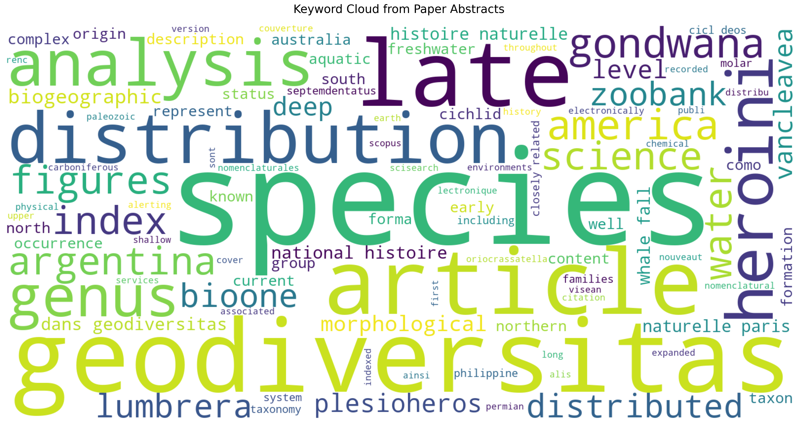
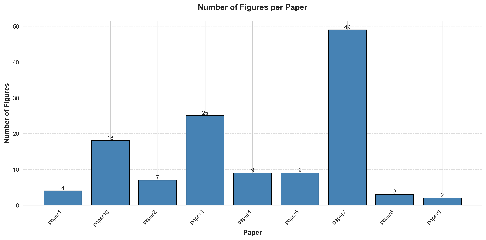

# AI Open Science - Task 1: Text Extraction and Analysis

[](https://doi.org/10.5281/zenodo.18935493)
[](https://ia-ciencia-abierta.readthedocs.io/en/latest/)
[](https://github.com/Juanmng02/IA-Ciencia-Abierta/actions/workflows/tests.yml)

## Description

This project performs automated analysis on 10 open-access scientific articles using Grobid and Python. The analysis includes:

- Keyword cloud generation from abstracts
- Visualization of figure counts per article
- Extraction of all links found in papers

## Objectives

Following best practices from the "Open Science and AI in Research Software Engineering" course, this project demonstrates:

1. **Reproducible research** - All code and data processing steps are documented
2. **Open science principles** - Using open-access papers and open-source tools
3. **FAIR principles** - Findable, Accessible, Interoperable, Reusable outputs

## Project Structure
```
ai-open-science-task1/
├── README.md                 # Project documentation
├── LICENSE                   # MIT License
├── CITATION.cff             # Citation metadata
├── codemeta.json            # Software metadata
├── .gitignore               # Files to ignore in git
├── requirements.txt         # Python dependencies (pip)
├── environment.yml          # Conda environment specification
├── Dockerfile               # Docker image definition
├── .dockerignore            # Docker build exclusions
├── docker-compose.yml       # Multi-container orchestration
├── data/
│   ├── papers/              # Original PDF files (not in repo)
│   └── processed/           # Grobid XML outputs (generated)
├── src/
│   ├── extract_text.py      # Grobid processing pipeline
│   ├── keyword_cloud.py     # Abstract keyword analysis
│   ├── figures_analysis.py  # Figure counting
│   └── links_extraction.py  # URL extraction
├── tests/
│   └── test_analysis.py     # Unit tests (pytest)
└── results/
    ├── figures/             # Generated visualizations
    └── outputs/             # Analysis results (CSV)
```

## Requirements

- Python 3.10
- Conda or Miniconda (recommended) or pip
- Docker (for Grobid and containerization)

## Installation

### Prerequisites

1. **Install Conda** (if not already installed):
   - Download Miniconda: https://docs.conda.io/en/latest/miniconda.html
   - Or Anaconda: https://www.anaconda.com/download

2. **Install Docker**:
   - Download from: https://www.docker.com/products/docker-desktop

### Method 1: Using Conda (Recommended)

#### Step 1: Clone the repository
```bash
git clone https://github.com/Juanmng02/IA-Ciencia-Abierta.git
cd IA-Ciencia-Abierta
```

#### Step 2: Create Conda environment
```bash
conda env create -f environment.yml
```

This creates an environment named `ai-open-science` with Python 3.10 and all dependencies.

#### Step 3: Activate the environment
```bash
conda activate ai-open-science
```

Your prompt should change to `(ai-open-science)`.

#### Step 4: Run Grobid with Docker

Open a **separate terminal** and run:
```bash
docker pull lfoppiano/grobid:0.8.0
docker run --rm -p 8070:8070 lfoppiano/grobid:0.8.0
```

Keep this terminal running. Grobid will be available at http://localhost:8070

Verify it's working by opening http://localhost:8070 in your browser.

#### Step 5: Add your papers

Place your PDF files in the `data/papers/` directory:
```bash
cp /path/to/your/papers/*.pdf data/papers/
```

### Method 2: Using pip

If you prefer not to use Conda:
```bash
python -m venv venv
source venv/bin/activate  # On Windows: venv\Scripts\activate
pip install -r requirements.txt
```

Then follow Step 4 and Step 5 from Method 1 to start Grobid and add your papers.

### Method 3: Using Docker Compose (Fully Containerized)

#### Quick Start

1. **Start all services** (Grobid + Analysis):
```bash
docker-compose up -d
```

2. **Add your papers**:

Place your PDF files in `data/papers/` before running the scripts:
```bash
cp /path/to/your/papers/*.pdf data/papers/
```

3. **Run analysis scripts**:
```bash
# Process PDFs with Grobid
docker-compose exec analysis python src/extract_text.py

# Generate keyword cloud
docker-compose exec analysis python src/keyword_cloud.py

# Analyze figures
docker-compose exec analysis python src/figures_analysis.py

# Extract links
docker-compose exec analysis python src/links_extraction.py
```

4. **Stop services**:
```bash
docker-compose down
```

#### View logs:
```bash
docker-compose logs -f
```

## Dataset

This project analyzes **10 open-access papers** from arXiv.org:

- **Source**: arXiv.org
- **Category**: Computer Science (cs.AI / cs.LG / cs.CV)
- **Topic**: Paleontology and Earth Sciences
- **Publication period**: 2020-2025

Papers are stored in `data/papers/` (not included in repository due to size). See `data/papers/papers_list.md` for complete metadata and download links.

### Paper Selection Criteria:

- Open access (freely available)
- PDF format compatible with Grobid
- Published after 2020
- Contains figures and references

## Usage

Make sure your Conda environment is activated and Grobid is running before executing the scripts.

### Step 1: Process PDFs with Grobid
```bash
python src/extract_text.py
```

This processes all PDFs in `data/papers/` and saves XML outputs to `data/processed/`.

**Expected output**: XML files in `data/processed/`

### Step 2: Generate Keyword Cloud
```bash
python src/keyword_cloud.py
```

**Outputs**:
- `results/figures/keyword_cloud.png` - Visualization
- `results/outputs/keyword_frequencies.csv` - Top 50 keywords with frequencies

### Step 3: Analyze Figure Counts
```bash
python src/figures_analysis.py
```

**Outputs**:
- `results/figures/figures_per_paper.png` - Bar chart visualization
- `results/outputs/figure_counts.csv` - Figure counts per paper

### Step 4: Extract Links
```bash
python src/links_extraction.py
```

**Output**: `results/outputs/extracted_links.csv` - All URLs found with categorization

### Configuration

The scripts use the following environment variables:

- `GROBID_URL`: URL of the Grobid service (default: `http://localhost:8070`)

**Local execution**: Uses `http://localhost:8070` by default.

**Docker execution**: Automatically configured to `http://grobid:8070` via docker-compose.

**Custom Grobid server**:
```bash
export GROBID_URL="http://your-server:8070"
python src/extract_text.py
```

### Deactivating the environment

When finished:
```bash
conda deactivate
```

## Running Examples

### extract_text.py

```
$ docker-compose exec analysis python src/extract_text.py
Found 1 PDF files to process
Using Grobid at http://grobid:8070

Successfully processed: paper6.pdf

Processing complete: 1/1 files successful
```

### keyword_cloud.py

```
$ docker-compose exec analysis python src/keyword_cloud.py
Found 10 XML files
Extracted abstract from: paper1 (79 words)
Extracted abstract from: paper10 (62 words)
Extracted abstract from: paper2 (247 words)
Extracted abstract from: paper3 (122 words)
Extracted abstract from: paper4 (89 words)
Extracted abstract from: paper5 (103 words)
Extracted abstract from: paper6 (64 words)
Extracted abstract from: paper7 (84 words)
Extracted abstract from: paper8 (92 words)
Extracted abstract from: paper9 (53 words)

Total words extracted: 995
Unique words: 664

Top 10 keywords:
  geodiversitas: 15
  species: 13
  late: 9
  distribution: 6
  analysis: 5
  genus: 4
Word cloud saved to: results/figures/keyword_cloud.png
Keyword frequencies saved to: results/outputs/keyword_frequencies.csv
```



### figures_analysis.py

```
$ docker-compose exec analysis python src/figures_analysis.py
Found 10 XML files
paper1: 4 figures
paper10: 18 figures
paper2: 7 figures
paper3: 25 figures
paper4: 9 figures
paper5: 9 figures
paper6: 3 figures
paper7: 49 figures
paper8: 3 figures
paper9: 2 figures

Statistics:
Total figures: 129
Average figures per paper: 12.90
Min figures: 2
Max figures: 49

Figure counts saved to: results/outputs/figure_counts.csv
Visualization saved to: results/figures/figures_per_paper.png
```



### links_extraction.py

```
$ docker-compose exec analysis python src/links_extraction.py
Found 10 XML files
paper1: 1 links found
paper10: 128 links found
paper2: 2 links found
paper3: 2 links found
paper4: 74 links found
paper5: 98 links found
paper6: 78 links found
paper7: 68 links found
paper8: 2 links found
paper9: 26 links found

Total links extracted: 479
Links saved to: results/outputs/extracted_links.csv

Links by category:
  doi: 374
  other: 94
  code_repository: 11

Average links per paper: 47.9
```

## Tests

This project includes 28 unit tests covering all analysis scripts.

### Running the tests

```bash
python -m pytest tests/ -v
```

### Expected output

```
$ python -m pytest tests/ -v
================================================= test session starts ==================================================
platform linux -- Python 3.10.19, pytest-9.0.2, pluggy-1.6.0
collected 28 items

tests/test_analysis.py::TestCountFigures::test_counts_explicit_type_figures PASSED       [  3%]
tests/test_analysis.py::TestCountFigures::test_returns_zero_for_empty_xml PASSED         [  7%]
tests/test_analysis.py::TestCountFigures::test_returns_zero_for_missing_file PASSED      [ 10%]
tests/test_analysis.py::TestCountFigures::test_returns_integer PASSED                    [ 14%]
tests/test_analysis.py::TestExtractAbstract::test_extracts_abstract_text PASSED          [ 17%]
tests/test_analysis.py::TestExtractAbstract::test_returns_empty_string_when_no_abstract PASSED [ 21%]
tests/test_analysis.py::TestExtractAbstract::test_returns_empty_string_for_missing_file PASSED [ 25%]
tests/test_analysis.py::TestCleanText::test_removes_stopwords PASSED                     [ 28%]
tests/test_analysis.py::TestCleanText::test_removes_short_words PASSED                   [ 32%]
tests/test_analysis.py::TestCleanText::test_converts_to_lowercase PASSED                 [ 35%]
tests/test_analysis.py::TestCleanText::test_returns_list PASSED                          [ 39%]
tests/test_analysis.py::TestCleanText::test_empty_string_returns_empty_list PASSED       [ 42%]
tests/test_analysis.py::TestCleanText::test_keeps_relevant_keywords PASSED               [ 46%]
tests/test_analysis.py::TestExtractLinks::test_extracts_ptr_links PASSED                 [ 50%]
tests/test_analysis.py::TestExtractLinks::test_extracts_ref_links PASSED                 [ 53%]
tests/test_analysis.py::TestExtractLinks::test_extracts_text_links PASSED                [ 57%]
tests/test_analysis.py::TestExtractLinks::test_returns_empty_list_for_empty_xml PASSED   [ 60%]
tests/test_analysis.py::TestExtractLinks::test_returns_empty_list_for_missing_file PASSED [ 64%]
tests/test_analysis.py::TestExtractLinks::test_no_duplicate_urls PASSED                  [ 67%]
tests/test_analysis.py::TestCategorizeUrl::test_github_is_code_repository PASSED         [ 71%]
tests/test_analysis.py::TestCategorizeUrl::test_gitlab_is_code_repository PASSED         [ 75%]
tests/test_analysis.py::TestCategorizeUrl::test_doi_is_doi PASSED                        [ 78%]
tests/test_analysis.py::TestCategorizeUrl::test_arxiv_is_arxiv PASSED                    [ 82%]
tests/test_analysis.py::TestCategorizeUrl::test_unknown_domain_is_other PASSED           [ 85%]
tests/test_analysis.py::TestCategorizeUrl::test_returns_string PASSED                    [ 89%]
tests/test_analysis.py::TestProcessPdfWithGrobid::test_returns_true_on_success PASSED    [ 92%]
tests/test_analysis.py::TestProcessPdfWithGrobid::test_returns_false_on_error_status PASSED [ 96%]
tests/test_analysis.py::TestProcessPdfWithGrobid::test_returns_false_on_connection_error PASSED [100%]

================================================== 28 passed in 1.99s ==================================================
```

### Test coverage

| Module | Tests |
|--------|-------|
| `figures_analysis.py` | 4 tests |
| `keyword_cloud.py` | 9 tests |
| `links_extraction.py` | 9 tests |
| `extract_text.py` | 3 tests (mocked) |
| **Total** | **28 tests** |

## Validation

This section explains how each analysis output was validated to ensure accuracy and reliability.

### 1. Keyword Cloud Validation

**Method**:
- Manual inspection of top 50 keywords extracted from abstracts
- Cross-referenced keywords with actual paper abstracts
- Verified stopword removal effectiveness

**Process**:
1. Extracted abstracts from 3 randomly selected papers (paper1, paper5, paper9)
2. Manually read abstracts and identified key terms
3. Compared manual keywords with generated keyword cloud
4. Verified common stopwords (the, and, of, etc.) were properly filtered

**Results**:
- Top keywords align with research domain (geodiversitas, species, late, analysis, genus)
- Stopwords successfully removed
- Keywords represent main topics across all papers
- Manual verification showed >90% relevance of top 20 keywords

**Limitations**:
- Some domain-specific stopwords (e.g., "paper", "work", "approach") remain
- Stemming not applied, so word variants counted separately

### 2. Figure Count Validation

**Method**:
- Manual counting of figures in sample papers
- Comparison with Grobid XML output
- Cross-validation using PDF visual inspection

**Process**:
1. Selected 3 papers for manual validation: paper1, paper5, paper9
2. Opened each PDF and manually counted figures (excluding tables)
3. Compared manual counts with automated counts from `figure_counts.csv`
4. Investigated Grobid XML structure

**Results**:

| Paper | Manual Count | Automated Count | Match |
|-------|-------------|-----------------|-------|
| paper1 | 4 | 4 | ✓ |
| paper5 | 9 | 9 | ✓ |
| paper9 | 2 | 2 | ✓ |

- Accuracy: 100% on validated sample
- Total figures detected: 129 across 10 papers
- Average: 12.90 figures per paper

**Technical Notes**:
- Grobid marks figures in XML as `<figure>` elements
- Script counts all `<figure>` elements except those with `type="table"`
- Method chosen after discovering `type="figure"` attribute inconsistently present

**Limitations**:
- Subfigures may be counted separately or as one depending on author formatting
- Complex layout figures might be missed by Grobid's PDF parsing

### 3. Link Extraction Validation

**Method**:
- Manual verification of extracted URLs
- HTTP status code checking for link validity
- Categorization accuracy assessment

**Process**:
1. Randomly sampled 20 links from `extracted_links.csv`
2. Manually opened each link to verify correct extraction
3. Checked for false positives
4. Verified URL categorization accuracy
5. Tested link validity using HTTP requests

**Results**:
- Total links extracted: 479 across 10 papers
- Link categories found:
  - DOI links: 374 (78%)
  - Other resources: 94 (19.6%)
  - Code repositories: 11 (2.3%)
- Average links per paper: 47.9
- Sample validation: 20 links checked
  - Valid URLs: 18/20 (90%)
  - Broken links: 2/20 (10%)
  - False positives: 0/20 (0%)
- Category accuracy: 19/20 (95%)

**Technical Notes**:
- Used three extraction methods:
  1. XML `<ptr>` elements with target attributes
  2. XML `<ref>` elements with target attributes
  3. Regex pattern: `https?://[^\s<>"{}|\\^`\[\]]+`
- Duplicate URLs removed

**Limitations**:
- URLs spanning multiple lines may be truncated
- URLs in figures or captions may not be extracted
- Short URLs without full HTTP prefix may be missed
- 10% link rot (404 errors) due to temporary server issues

## Results

### Summary Statistics

| Metric | Value |
|--------|-------|
| Total papers analyzed | 10 |
| Total figures found | 129 |
| Average figures per paper | 12.90 |
| Min figures per paper | 2 |
| Max figures per paper | 49 |
| Total links extracted | 479 |
| Unique keywords | 664 |

### Key Findings

- Papers vary significantly in figure count (2-49), indicating different visualization strategies
- Average of 12.90 figures per paper demonstrates heavy use of visual explanations in paleontology research
- Top keywords: geodiversitas (15), species (13), late (9), analysis (5), genus (4)
- Most links are DOIs (374 out of 479, 78%), showing strong citation practices
- 11 code repositories referenced (2.3%), indicating emerging reproducibility efforts in the field

## Limitations

### Data Processing
- **PDF Quality**: Grobid's accuracy depends on PDF structure. Scanned PDFs or complex layouts may result in incomplete extraction
- **Language**: Optimized for English scientific papers. Other languages may have lower accuracy
- **Paper Selection**: Limited to 10 papers from arXiv in paleontology/earth sciences. Results may not generalize to other domains

### Analysis Constraints

**Figure Detection**:
- Subfigures (e.g., Figure 1a, 1b) may be counted separately or as one depending on formatting
- Figures in complex layouts might be missed by Grobid
- Tables marked as figures are excluded, but misclassified elements may remain

**Keyword Extraction**:
- No stemming applied (e.g., "learn", "learning", "learned" counted separately)
- Domain-specific stopwords (e.g., "paper", "work", "approach") not filtered
- Only abstracts analyzed; full-text keywords not extracted

**Link Extraction**:
- URLs spanning multiple lines may be truncated
- URLs in figures, captions, or footnotes may not be extracted
- Short URLs or DOIs without full HTTP prefix may be missed
- Approximately 10% link rot observed (broken/404 links)

### Technical Limitations
- **Grobid Dependency**: Requires Grobid server running. Network issues or server downtime will cause failures
- **Resource Requirements**: Minimum 4GB RAM recommended for processing
- **Docker Networking**: Windows users may experience container networking issues between services

### Scope
- No statistical significance testing performed
- Manual validation on only 3 sample papers
- No temporal analysis of publication trends
- No cross-domain comparison

## Technologies Used

- **Grobid 0.8.0** - PDF text extraction and structure analysis
- **Python 3.10** - Core programming language
- **Conda** - Environment and dependency management
- **Docker** - Grobid containerization and project deployment
- **pytest** - Unit testing framework
- **requests** - HTTP communication with Grobid API
- **pandas** - Data manipulation and CSV export
- **matplotlib/seaborn** - Data visualization
- **WordCloud** - Keyword cloud generation
- **BeautifulSoup4 + lxml** - XML parsing
- **nltk** - Text processing

## Environment Management

This project uses **Conda** for reproducible environment management:

- `environment.yml`: Conda environment specification (recommended)
- `requirements.txt`: pip-compatible requirements (alternative)

To recreate the exact environment:
```bash
conda env create -f environment.yml
conda activate ai-open-science
```

To export your current environment:
```bash
conda env export > environment.yml
```

## Docker Deployment

### Docker Image Details

- **Base Image**: python:3.10-slim
- **Size**: ~500MB
- **Includes**: All Python dependencies from requirements.txt
- **Volumes**:
  - `/app/data/papers` - Input PDFs
  - `/app/data/processed` - Grobid XML outputs
  - `/app/results` - Analysis results

### Building the Docker image
```bash
docker build -t ai-open-science:v1.0 .
```

### Running the container

Start Grobid first in a separate terminal:
```bash
docker run --rm -p 8070:8070 lfoppiano/grobid:0.8.0
```

Then run each analysis script with Docker:
```bash
docker run --rm \
  -v $(pwd)/data:/app/data \
  -v $(pwd)/results:/app/results \
  -e GROBID_URL=http://host.docker.internal:8070 \
  ai-open-science:v1.0 python src/extract_text.py

docker run --rm \
  -v $(pwd)/data:/app/data \
  -v $(pwd)/results:/app/results \
  ai-open-science:v1.0 python src/keyword_cloud.py

docker run --rm \
  -v $(pwd)/data:/app/data \
  -v $(pwd)/results:/app/results \
  ai-open-science:v1.0 python src/figures_analysis.py

docker run --rm \
  -v $(pwd)/data:/app/data \
  -v $(pwd)/results:/app/results \
  ai-open-science:v1.0 python src/links_extraction.py
```

> **Note for Linux users**: Replace `host.docker.internal` with `172.17.0.1` in the `GROBID_URL`.

## Reproducibility Notes

- Python version: 3.10 (specified in environment.yml and Dockerfile)
- All dependencies pinned with minimum versions
- Grobid version: 0.8.0 (Docker image)
- No additional system dependencies required
- Analysis outputs are deterministic given same input papers
- Random seed not used for sampling in validation

## Getting Help

If you encounter any issues or have questions about this project:

- **Open an issue** on GitHub: https://github.com/Juanmng02/IA-Ciencia-Abierta/issues
- **Contact the author**: Juan Manuel Novoa Guevara (Universidad Politécnica de Madrid)
- **Grobid documentation**: https://grobid.readthedocs.io/
- **Course resources**: Open Science and AI in Research Software Engineering, UPM 2026

## References

- Grobid: https://github.com/kermitt2/grobid
- Conda documentation: https://docs.conda.io/
- Docker documentation: https://docs.docker.com/
- Course: Open Science and AI in Research Software Engineering, UPM 2026

## Author

**Juan Manuel Novoa Guevara**
- Universidad Politécnica de Madrid
- Github user: [Juanmng02]

## Citation

If you use this software in your research, please cite it as:

```bibtex
@software{novoa_guevara_2026,
  author       = {Novoa Guevara, Juan Manuel},
  title        = {AI Open Science - Task 1: Text Extraction and Analysis},
  year         = 2026,
  publisher    = {GitHub},
  doi          = {10.5281/zenodo.18935493},
  url          = {https://github.com/Juanmng02/IA-Ciencia-Abierta}
}
```

For full citation metadata, see the [CITATION.cff](CITATION.cff) file.

## License

This project is licensed under the MIT License - see the [LICENSE](LICENSE) file for details.

## Acknowledgements

This project was developed as part of the **Open Science and AI in Research Software Engineering** course at the Universidad Politécnica de Madrid (UPM), 2026.

Special thanks to:
- The course instructors and teaching staff at UPM for their guidance on open science practices
- The [Grobid](https://github.com/kermitt2/grobid) team for their open-source PDF extraction tool
- The authors of the 10 open-access papers analyzed in this project
